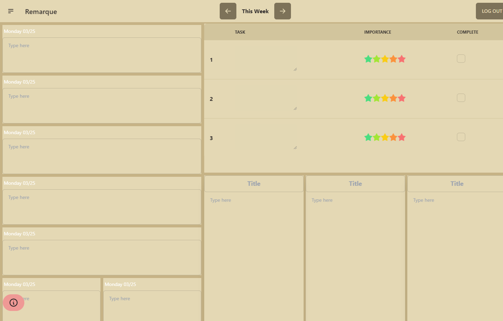
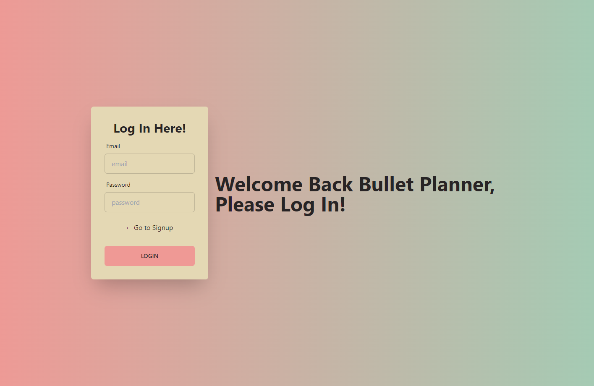

<!-- Improved compatibility of back to top link: See: https://github.com/othneildrew/Best-README-Template/pull/73 -->

<a name="readme-top"></a>

<!--
*** Thanks for checking out the Best-README-Template. If you have a suggestion
*** that would make this better, please fork the repo and create a pull request
*** or simply open an issue with the tag "enhancement".
*** Don't forget to give the project a star!
*** Thanks again! Now go create something AMAZING! :D
-->

<!-- PROJECT SHIELDS -->
<!--
*** I'm using markdown "reference style" links for readability.
*** Reference links are enclosed in brackets [ ] instead of parentheses ( ).
*** See the bottom of this document for the declaration of the reference variables
*** for contributors-url, forks-url, etc. This is an optional, concise syntax you may use.
*** https://www.markdownguide.org/basic-syntax/#reference-style-links
-->

[![Contributors][contributors-shield]][contributors-url]
[![Forks][forks-shield]][forks-url]
[![Stargazers][stars-shield]][stars-url]
[![Issues][issues-shield]][issues-url]
[![ClosedRequests][cr-shield]][cr-url]
[![MIT License][license-shield]][license-url]

<!-- PROJECT LOGO -->
<br />
<div align="center">
  <a href="https://github.com/mhengerer/Remarque">
    
  </a>

  <h3 align="center">Remarque</h3>

  <p align="center">
    Simply a bullet journal application 
    <br />
    <a href="https://github.com/mhengerer/Remarque"><strong>Explore the docs »</strong></a>
    <br />
    <br />
    <a href="https://github.com/mhengerer/Remarque">View Demo</a>
    ·
    <a href="https://github.com/mhengerer/Remarque/issues">Report Bug</a>
    ·
    <a href="https://github.com/mhengerer/Remarque/issues">Request Feature</a>
  </p>
</div>

<!-- TABLE OF CONTENTS -->
<details>
  <summary>Table of Contents</summary>
  <ol>
    <li>
      <a href="#about-the-project">About The Project</a>
      <ul>
        <li><a href="#built-with">Built With</a></li>
      </ul>
    </li>
    <li>
      <a href="#getting-started">Getting Started</a>
      <ul>
        <li><a href="#prerequisites">Prerequisites</a></li>
        <li><a href="#installation">Installation</a></li>
      </ul>
    </li>
    <li><a href="#usage">Usage</a></li>
    <li><a href="#contributing">Contributing</a></li>
    <li><a href="#license">License</a></li>
    <li><a href="#contact">Contact</a></li>
    <li><a href="#acknowledgments">Acknowledgments</a></li>
  </ol>
</details>

<!-- ABOUT THE PROJECT -->

## About The Project




about remarque...

<p align="right">(<a href="#readme-top">back to top</a>)</p>

### Built With

a list of major frameworks/libraries used to bootstrap your project

- [![Vite][vite.js]][vite-url]
- [![React][react.js]][react-url]
- [![Tailwindcss][tailwindcss]][tailwindcss-url]
- [![JWT][jwt]][jwt-url]
- [![Express.js][express.js]][express-url]
- [![MongoDB][mongodb]][mongodb-url]

<p align="right">(<a href="#readme-top">back to top</a>)</p>

<!-- GETTING STARTED -->

## Getting Started

This is an example of how you may give instructions on setting up your project locally.
To get a local copy up and running follow these simple example steps.

### Prerequisites

This is an example of how to list things you need to use the software and how to install them.

- npm
  ```sh
  npm install npm@latest -g
  ```

### Installation

_Below is an example of how you can instruct your audience on installing and setting up your app. This template doesn't rely on any external dependencies or services._

2. Clone the repo
   ```sh
   git clone git@github.com:mhengerer/Remarque.git
   ```
3. Install NPM packages
   ```sh
   npm install
   ```
4. Build page
   ```sh
   npm run develop
   ```

<p align="right">(<a href="#readme-top">back to top</a>)</p>

<!-- USAGE EXAMPLES -->

## Usage

Use this space to show useful examples of how a project can be used. Additional screenshots, code examples and demos work well in this space. You may also link to more resources.

_For more examples, please refer to the [Documentation](https://example.com)_

<p align="right">(<a href="#readme-top">back to top</a>)</p>

<!-- CONTRIBUTING -->

## Contributing

Contributions are what make the open source community such an amazing place to learn, inspire, and create. Any contributions you make are **greatly appreciated**.

If you have a suggestion that would make this better, please fork the repo and create a pull request. You can also simply open an issue with the tag "enhancement".
Don't forget to give the project a star! Thanks again!

1. Fork the Project
2. Create your Feature Branch (`git checkout -b feature/AmazingFeature`)
3. Commit your Changes (`git commit -m 'Add some AmazingFeature'`)
4. Push to the Branch (`git push origin feature/AmazingFeature`)
5. Open a Pull Request

<p align="right">(<a href="#readme-top">back to top</a>)</p>

<!-- LICENSE -->

## License

Distributed under the MIT License. See `MIT.txt` for more information.

<p align="right">(<a href="#readme-top">back to top</a>)</p>

<!-- CONTACT -->

## Contact

Project Link: [https://github.com/mhengerer/Remarque](https://github.com/mhengerer/Remarque)

<p align="right">(<a href="#readme-top">back to top</a>)</p>

<!-- ACKNOWLEDGMENTS -->

## Acknowledgments

Use this space to list resources you find helpful and would like to give credit to. I've included a few of my favorites to kick things off!

- [Choose an Open Source License](https://choosealicense.com)
- [GitHub Emoji Cheat Sheet](https://www.webpagefx.com/tools/emoji-cheat-sheet)
- [Malven's Flexbox Cheatsheet](https://flexbox.malven.co/)
- [Malven's Grid Cheatsheet](https://grid.malven.co/)
- [Img Shields](https://shields.io)
- [GitHub Pages](https://pages.github.com)
- [Font Awesome](https://fontawesome.com)
- [React Icons](https://react-icons.github.io/react-icons/search)

<p align="right">(<a href="#readme-top">back to top</a>)</p>

<!-- MARKDOWN LINKS & IMAGES -->
<!-- https://www.markdownguide.org/basic-syntax/#reference-style-links -->

[contributors-shield]: https://img.shields.io/github/contributors/mhengerer/Remarque.svg?style=for-the-badge
[contributors-url]: https://github.com/mhengerer/Remarque/graphs/contributors
[forks-shield]: https://img.shields.io/github/forks/mhengerer/Remarque.svg?style=for-the-badge
[forks-url]: https://github.com/mhengerer/Remarque/network/members
[stars-shield]: https://img.shields.io/github/stars/mhengerer/Remarque.svg?style=for-the-badge
[stars-url]: https://github.com/mhengerer/Remarque/stargazers
[issues-shield]: https://img.shields.io/github/issues/mhengerer/Remarque.svg?style=for-the-badge
[issues-url]: https://github.com/mhengerer/Remarqueissues
[cr-shield]: https://img.shields.io/github/issues-pr-closed-raw/mhengerer/Remarque.svg?style=for-the-badge
[cr-url]: https://github.com/mhengerer/Remarque/pulls?q=is%3Apr+is%3Aclosed
[license-shield]: https://img.shields.io/github/license/mhengerer/Remarque.svg?style=for-the-badge
[license-url]: https://github.com/mhengerer/Remarque/blob/master/LICENSE.txt
[product-screenshot]: client\public\remarqueherokulogin.png
[product-screenshot2]: client\public\remarqueheroku2.png
[vite.js]: https://img.shields.io/badge/vite-%23646CFF.svg?style=for-the-badge&logo=vite&logoColor=white
[vite-url]: https://vitejs.dev/
[react.js]: https://img.shields.io/badge/React-20232A?style=for-the-badge&logo=react&logoColor=61DAFB
[react-url]: https://reactjs.org/
[tailwindcss]: https://img.shields.io/badge/tailwindcss-%2338B2AC.svg?style=for-the-badge&logo=tailwind-css&logoColor=white
[tailwindcss-url]: https://tailwindcss.com/
[framer]: https://img.shields.io/badge/Framer-black?style=for-the-badge&logo=framer&logoColor=blue
[framer-url]: https://framerui.com/
[jwt]: https://img.shields.io/badge/JWT-black?style=for-the-badge&logo=JSON%20web%20tokens
[jwt-url]: https://jwt.io/
[express.js]: https://img.shields.io/badge/express.js-%23404d59.svg?style=for-the-badge&logo=express&logoColor=%2361DAFB
[express-url]: https://expressjs.com/
[mongodb]: https://img.shields.io/badge/MongoDB-%234ea94b.svg?style=for-the-badge&logo=mongodb&logoColor=white
[mongodb-url]: https://www.mongodb.com/
[redux]: https://img.shields.io/badge/redux-%23593d88.svg?style=for-the-badge&logo=redux&logoColor=white
[redux-url]: https://redux.js.org/
